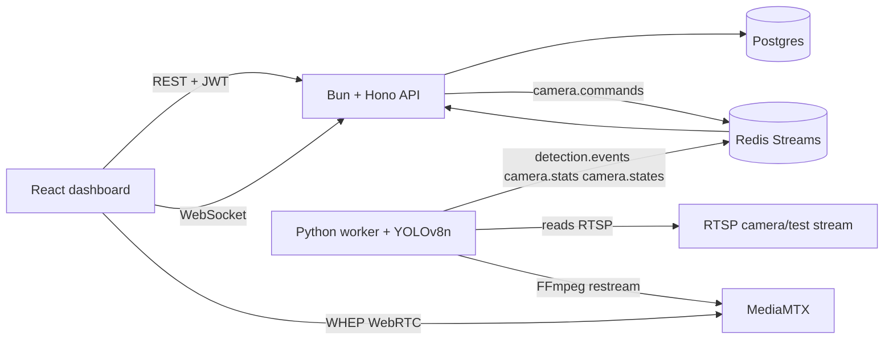

# Real-Time Camera Surveillance Dashboard

A production-shaped local Video Management System with camera CRUD, JWT auth, WebRTC playback through MediaMTX, Redis Streams for runtime commands/events, Postgres persistence, and YOLOv8n person detection in a Python worker.

The complete demo path is working: register a camera, start it, watch live video, detect a person, persist the alert, and receive camera stats and alerts without refreshing.

## Architecture



The API owns users, cameras, alerts, deduplication, and realtime WebSocket fanout. The worker consumes start/stop commands and runs each camera independently, so one failed stream does not stop the others.

## Quick Start

1. Optionally copy the environment defaults:

```bash
cp .env.example .env
```

2. Start everything:

```bash
docker compose up --build
```

3. Open the frontend:

```text
http://localhost:5173
```

Demo login:

```text
username: demo
password: password
```

4. Add a camera and use the bundled RTSP demo stream:

```text
rtsp://mediamtx:8554/testcam
```

The bundled demo stream loops `demo-assets/person-demo-frame.png`, so it can exercise RTSP ingest, restreaming, WebRTC playback, stats, and YOLO person detection.

Open **Stream diagnostics** on a camera tile to compare requested state, worker state, and browser playback state.

## Services

- `frontend`: React + TypeScript + Vite dashboard.
- `api`: Bun + Hono REST/WebSocket service.
- `worker`: Python + OpenCV + Ultralytics YOLOv8n detector.
- `postgres`: users, cameras, alerts, stats.
- `redis`: camera commands and worker event streams.
- `mediamtx`: RTSP ingress and WebRTC/WHEP playback.
- `ffmpeg-testcam`: local RTSP test stream.

## API

Auth:

- `POST /auth/signup`
- `POST /auth/login`

Cameras, all protected by `Authorization: Bearer <token>`:

- `GET /cameras`
- `POST /cameras`
- `PATCH /cameras/:id`
- `DELETE /cameras/:id`
- `POST /cameras/:id/start`
- `POST /cameras/:id/stop`
- `GET /cameras/:id/health`

Alerts:

- `GET /alerts?cameraId=&from=&to=&limit=&cursor=`

Realtime:

- `GET /ws?token=<jwt>`

## Canonical Event Format

The shared command/event contract is documented in:

```text
docs/event-format.md
```

The worker, Redis event stream, API, database mapping, and WebSocket payload use this core alert shape:

```json
{
  "eventId": "uuid",
  "type": "person_detected",
  "cameraId": "uuid",
  "userId": "uuid",
  "occurredAt": "2026-08-06T12:00:00.000Z",
  "confidence": 0.87,
  "bbox": { "x": 120, "y": 64, "width": 180, "height": 420 },
  "snapshotUrl": null,
  "source": "worker",
  "model": "yolov8n-coco",
  "dedupeKey": "cameraId:person:time-bucket"
}
```

WebSocket message envelopes:

```json
{ "type": "alert.created", "payload": {} }
{ "type": "camera.stats", "payload": { "cameraId": "uuid", "fps": 25, "detectionsPerMinute": 2, "state": "live", "updatedAt": "2026-08-06T12:00:00.000Z" } }
{ "type": "camera.state", "payload": { "cameraId": "uuid", "state": "error", "error": "message", "updatedAt": "2026-08-06T12:00:00.000Z" } }
```

## Detection Model

The worker uses Ultralytics YOLOv8n pretrained on COCO and filters to class `person`. YOLOv8n is a good demo default because it is small, easy to run on CPU, well documented, and can later be replaced with a larger GPU-backed model without changing the event contract.

## Tests

Run the test suites in the same container environments used by the application:

```powershell
docker compose build api frontend worker
docker compose run --rm --no-deps api sh -c "bun run typecheck && bun test"
docker compose run --rm --build frontend-test
docker compose run --rm --no-deps worker python -m pytest -q
```

The tests cover event encoding, camera validation, ownership-scoped database queries, authenticated HTTP camera routes, frontend authentication/dashboard smoke behavior, and worker command recovery.

## Project Guides

- `docs/architecture.md`: beginner-friendly service and data-flow explanation.
- `docs/docker-compose-walkthrough.md`: Compose services, ports, and environment variables.
- `docs/worker-walkthrough.md`: Python detection-worker walkthrough.
- `docs/event-format.md`: Redis and WebSocket contracts.
- `docs/troubleshooting.md`: pipeline-first debugging commands.
- `docs/demo-script.md`: five-minute interview walkthrough.

## Kubernetes

Optional manifests live in `infra/k8s/surveillance.yaml`.

For a local cluster, first build and load the three local images as `surveillance-api:local`, `surveillance-worker:local`, and `surveillance-frontend:local`, then run:

```bash
kubectl apply -f infra/k8s/surveillance.yaml
```

The Kubernetes setup is intentionally simple and demo-oriented. For production, replace the in-cluster Postgres/Redis deployments with managed services or persistent volumes, use real secrets, configure ingress/TLS, and add a TURN server for WebRTC clients behind restrictive networks.

## Current Limitations

This repository is suitable for a local portfolio demo, but it is not yet an internet-facing production deployment:

- One worker restores all active cameras; multiple workers would require leases or camera partitioning.
- Postgres, Redis, and generated media are local and have no production backup policy.
- The default JWT secret and permissive CORS are development settings.
- WebRTC is configured for localhost and has no TURN server for restrictive networks.
- Alerts store metadata but not image snapshots.
- The demo stream repeats one still image, so detection confidence is intentionally repetitive.

## Future Improvements

- Persist snapshots to object storage and attach `snapshotUrl` to alerts.
- Add GPU inference and worker sharding by camera ownership or consistent hashing.
- Add a model registry and per-camera detection settings.
- Add refresh tokens, stricter CORS, and production password policy.
- Add TURN/STUN configuration for tougher WebRTC network environments.
- Add deeper integration tests that boot Compose, create cameras, and verify event fanout.
